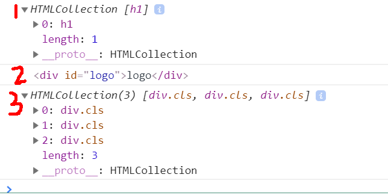

# Web API

## 一、javaScript组成

一个完整的JavaScript实现应该由下列三个部分组成

- 核心（ECMAScript) --- js语法规范
- 文档对象模型（DOM）--- Document Object Model
- 浏览器对象模型（BOM）--- Browser Object Model

初级阶段我们学习DOM+BOM的属性和方法，并使用它们实现页面上的效果。

## 二、DOM--文档对象模型

 > 文档对象模型（DOM，Document Object Model）是针对XML但经过拓展用于HTML的应用程序编程接口（API，Application Programming Interface）。
 >
 > DOM包含核心DOM、XML DOM和HTML DOM。

HTML DOM 是关于如何获取、添加、修改和删除HTML元素的标准。

在HTML DOM中，HTML文档中所有的内容都被视为节点，DOM被视为节点树的HTML。

- 整个文档视为一个文档节点
- 每个HTML元素视为元素节点
- HTML元素中的文本视为文本节点
- 每个HTML属性为属性节点
- 注释为注释节点


### （一）获取元素对象（获取DOM节点）id & tagname & classname

#### Ⅰ语法

##### id--getElementById

```html
//结构
<div id="logo">logo</div>
```

```js
//js-获取DOM元素
var logo = document.getElementById('logo');
//返回匹配的单个元素
console.log(logo);  //<div id="logo">logo</div>
```

##### tagname--getElementsByTagName

```html
//结构
<h1>大标题</h1>
```

```js
//js-获取DOM元素
var h1 = document.getElementsByTagName('h1');
//返回的是伪数组形式
console.log(h1);  //HTMLCollection [h1]
```

##### classname--getElementsByClassName

```html
//结构
<div class="cls">类</div>
<div class="cls">类</div>
<div class="cls">类</div>
```

```js
var cls = document.getElementsByClassName('cls');
//返回的是伪数组形式
console.log(cls); //HTMLCollection(3) [div.cls, div.cls, div.cls]
```

##### querySelector--querySelector 常用！！！

```html
<h1>大标题</h1>
<div id="logo">logo</div>
<div class="cls abc">类</div>
<div class="cls">类</div>
```

```js
//获取h1元素
var h1 = document.querySelector('h1');
//返回单个元素
console.log(h1);//<h1>大标题</h1>

//获取id为logo的元素
var logo = document.querySelector('#logo');
//返回单个元素
console.log(logo);//<div id="logo">logo</div>

//获取类为cls的第一个元素
var cls = document.querySelector('.cls');
//返回匹配的第一个个元素
console.log(cls);//<div class="cls abc">类</div>

//获取类为cls的全部元素
var clss = document.querySelectorAll('.cls');
//返回一个伪数组，NodeList实例
console.log(clss);//NodeList(2) [div#asd.cls, div.cls.abc]
```


以下为控制台输出结果。通过id获取元素是唯一的。通过tagName和className获取到的都是伪数组。




#### Ⅱ获取元素对象位置 offsetLeft & offsetTop

```js
// 得到的是某个元素距离他的offsetParent元素的水平距离
// 元素.offsetLeft = marginLeft + left
元素.offsetLeft 

// 得到的是某个元素距离他的offsetParent元素的垂直距离
// 元素.offsetTop = marginTop + top
元素.offsetTop 

// 找到一个有定位的父亲元素进行参考，如果亲生父亲没有定位，会一直往上找，直到找打有定位的父亲，或者body；
元素的offsetParent
```


#### Ⅲ类样式对象

classList：DOM元素对象的一个属性对象，管理所有类名。

**语法**

- add：给元素对象添加一个或者多个类名，不会影响原来的类名

```js
//添加类名
box.classList.add(类名1，类名2...);
```

- remove：给元素删除一个或者多个类名

```js
//删除类名
box.classList.remove(类名1，类名2...);
```

- toggle：切换类名

```js
//切换类名
box.classList.toggle(类名);
```

  

### （二）注册事件 

事件类型：click, focus, blur, mousedown, mousemove, mouseup

#### Ⅰ语法

###### on

```js
//语法
事件源.on+事件类型 = function(event){ 
    
}

//点击按钮-->事件处理程序被执行
btn.onclick = function() {
    console.log('被点击了');
}
//onfocus 和 onblur 都是针对于可获得光标的标签，如input, texarea
ipt.onfocus = function() {
    //获得光标时的事
}
ipt.onblur = function() {
    //失去光标时的事
}
```

on注册事件，本质是把一个函数存储到了on这个属性里面，后面若被重复赋值，则上面的会被覆盖。无法多次注册。

###### addEventListener ！！！

添加事件监听，可以多次注册事件。

```js
//语法
事件源.addEventListener(事件类型,function(e){
    
});

//获取对象元素
var btn = document.querySelector('#btn');
//  参数： 事件类型 - 字符串； 事件处理程序 - function 
// 用户点击之后，以下事件都会触发
btn.addEventListener('click', function() {
    console.log(123);
})
btn.addEventListener('click', function() {
    console.log(456);
})
btn.addEventListener('click', function() {
    console.log(789);
})
```

#### Ⅱ事件对象

万物皆对象，把一次**事件行为**也看成对象。

###### 属性：

```js
// 鼠标位置

// 可视区域坐标系 - 以浏览器的可视区域的左上角为原点的
// 可视区域：就是元素用来显示内容的区域
事件对象.clientX
事件对象.clientY

// 页面坐标系  -  以body的左上角作为原点
事件对象.pageX
事件对象.pageY


// 事件的目标对象，用户点击到谁上面了；用于事件委托；
事件对象.target

// 事件的绑定对象，就是是绑定在哪个DOM节点上 和 this一样
// 前面说的事件源，
e.currentTarget==this -----> true
```

###### 方法：

```js
// 阻止冒泡
事件对象.stopPropagation();

// 阻止默认行为；
事件对象.preventDefault();


// 页面右键事件 查看右键菜单
document.oncontextmenu = function(e){
  e.preventDefault();
}

// 阻止a标签转跳
// 1 把a标签的href属性设置为 javascript:void(0);
// 2 在a标签的点击事件里面，return false;
// 3 使用事件对象.preventDefault();
dom_a.addEventListener('click', function(e) {
    e.preventDefault();
});
```


### （三）操作属性 
属性有**标准属性**：style & value & src & checked & disabled等和**自定义属性**

#### Ⅰ标准属性：html标准中出现的，有特殊功能的属性

##### 语法:

###### style

```js
// 获取：只能获取行内样式；
div.style.backgroundColor
// 设置
div.style.backgroundColor = '#fff';
```

```js
//小例：点击盒子，背景色改变
var closeBtn = document.getElementById('close');
closeBtn.onclick = function(){
  closeBtn.style.backgroundColor = ’red‘;
}
```


###### checked/selected/disabled
只有两个值：true & false

```js
var ck = document.getElementById('ck');

ck.checked = true;
ck.checked = false;
```


#### Ⅱ自定义属性：开发者根据自己的需要，把数据存储到对应元素身上时使用的属性，没有特殊功能

##### 语法

```js
//命名：标签中自定义属性  data-属性名
<input type="button" value="美女" data-src="./images/01.jpg">;

btn.onclick = function () {
    img.src = this.dataset.src;
}
```
#### Ⅲ操作属性
这个属性操作更为灵活，标准属性和自定义属性都可以。一般情况情况下操作自定义属性多一些，且自定义属性不再限制于 data-属性 的格式要求

```js
//根据属性名获取属性值
元素.getAttribute(属性名)

//添加或者修改属性的值
元素.setAttribute(属性名,属性值)

//删除某个属性
元素.removeAttribute(属性名)

```

## 三、案例：

### 案例1-开关灯（两个按钮）

**涉及知识点**：

- 获取元素对象 getElementById()
- 操作属性 style

结构：

```html
<div class="tv">
	<input type="button" id="btn1" value="关灯">
    <input type="button" id="btn2" value="开灯">
</div>

```

样式：

```css
.tv {
    width: 300px;
    height: 200px;
    border: 1px solid #ccc;
   	margin: 100px auto;
}

```


js:

```js
var btn1 = document.getElementById('btn1');
var btn2 = document.getElementById('btn2');

btn1.onclick = function () {
     document.body.style.backgroundColor = '#000';
}
 btn2.onclick = function () {
     document.body.style.backgroundColor = '#fff';
}

```

### 案例1-开关灯（一个按钮）

**涉及知识点**：

- 获取元素对象 getElementById()
- 操作属性 style value
- 注册事件 onclick
- if分支，开关思想

结构：

```html
    <div class="tv">
        <input type="button" id="btn" value="关灯">
    </div>

```

样式同上：

js：

```js
var btn = document.getElementById('btn');

btn.onclick = function () {
    if (btn.value == '关灯') {
        document.body.style.backgroundColor = '#000';
        btn.value = '开灯';
    } else {
        document.body.style.backgroundColor = '#fff';
        btn.value = '关灯';
    }
}

```


### 案例2-搜索区显示隐藏（方法一：style）

**涉及知识点**：

- 获取元素对象 getElementById()
- 操作属性 style
- 注册事件 onfocus， onblur
- css复习：display: block; display: none;

结构：

```html
    <div class="box">
        <input type="text" id="ipt">
        <div class="search" id="search">
            
        </div>
    </div>

```

样式：

```css
* {
    margin: 0;
    padding: 0;

.box {
    position: relative;
    top: 100px;
    left: 300px;

input {
    box-sizing: border-box;
    width: 300px;
    height: 56px;
    background: url(./images/search.png) no-repeat;
    border: 0;
    outline: 0;
    padding: 4px 8px;
    font-size: 24px;

.search {
    position: absolute;
    width: 244px;
    border: 1px solid #ccc;
    top: 52px;
    left: 2px;
    display: none;
}

```

js:

```js
var ipt = document.getElementById('ipt');
var search = document.getElementById('search');
ipt.onfocus = function () {
    search.style.display = 'block';
}
ipt.onblur = function () {
    search.style.display = 'none';
}

```

### 案例2-搜索区显示隐藏（方法二：classList）

**涉及知识点**：

- 获取元素对象 getElementById()
- 操作属性 style
- 注册事件 onfocus， onblur
- css复习：display: block; display: none;
- 类样式对象 add remove 添加删除类名

样式增加一个show:

```css
//添加类名
.show {
    display: block;
}
```

js:

```js
var ipt = document.getElementById('ipt');
var search = document.getElementById('search');
ipt.onfocus = function () {
    search.classList.add('show');
}
ipt.onblur = function () {
    search.classList.remove('show');
}

```


### 案例3：点击按钮切换图片

**涉及知识点**：

- 获取元素对象（伪数组） getElementsByClassName()
- 操作属性 style src
- 注册事件 onclick
- this获取当前用户点击的对象元素，触发对应事件


结构：

```html
<input type="button" class="btn" value="图片1" data-src="./images/01.jpg">
<input type="button" class="btn" value="图片2" data-src="./images/02.jpg">
<input type="button" class="btn" value="图片3" data-src="./images/03.jpg">
<input type="button" class="btn" value="图片4" data-src="./images/04.jpg">
<input type="button" class="btn" value="图片5" data-src="./images/05.jpg">
<br>


```

样式：

```css
img {
    width: 300px;
}

```

js:

```js
var btn = document.getElementsByClassName('btn');
var img = document.getElementById('img');
for (var i = 0; i < btn.length; i++) {
    btn[i].onclick = function () {
        img.src = this.dataset.src;
    } 
}

```

### 案例4-全选与取消&反选与取消

需求：

- 点全选按钮，下面子选项都自动被同时选中

- 子选项一个一个全选上时，全选按钮自动被选

要点：

- 理顺逻辑
- checked属性的使用
- “开关”--`flag=true`和`flag=false`

结构

```html
    <table>
        <tr>
            <th>
                <input type="checkbox" name="" id="checkAll" />全选/全不选
            </th>
            <th>菜名</th>
            <th>商家</th>
            <th>价格</th>
        </tr>
        <tr>
            <td>
                <input type="checkbox" name="check" class="ck" />
            </td>
            <td>红烧肉</td>
            <td>隆江猪脚饭</td>
            <td>￥200</td>
        </tr>
        <tr>
            <td>
                <input type="checkbox" name="check" class="ck" />
            </td>
            <td>香酥排骨</td>
            <td>隆江猪脚饭</td>
            <td>￥998</td>
        </tr>
        <tr>
            <td>
                <input type="checkbox" name="check" class="ck" />
            </td>
            <td>北京烤鸭</td>
            <td>隆江猪脚饭</td>
            <td>￥88</td>
        </tr>
    </table>

```


样式：

```css
    
        * {
            margin: 0;
            padding: 0;
        }

        table {
            border-collapse: collapse;
            border-spacing: 0;
            border: 1px solid #c0c0c0;
            width: 500px;
            margin: 100px auto;
            text-align: center;
        }

        th {
            background-color: #09c;
            font: bold 16px "微软雅黑";
            color: #fff;
            height: 24px;
        }

        td {
            border: 1px solid #d0d0d0;
            color: #404060;
            padding: 10px;
        }
   

```

js:

```js
        // 获取DOM节点 
        var ckAll = document.getElementById('checkAll');
        var cks = document.getElementsByClassName('ck');
        // 注册事件
        ckAll.onclick = function () {
            for (var i = 0; i < cks.length; i++) {
                cks[i].checked = ckAll.checked;
            }
        }


        // 反选
        //注册事件
        for (var i = 0; i < cks.length; i++) {
            cks[i].onclick = function () {
                //先假设三个都选上了
                var flag = true;
                //找反例-只要子选项有一个没选中，退出循环，全选按钮不选中，剩下的子选项也不需要再判断了
                for(var j = 0; j < cks.length; j++) {
                    if(cks[j].checked == false) {
                        flag = false;
                        break;
                    }
                }
                checkAll.checked = flag;
            }
        }


```


